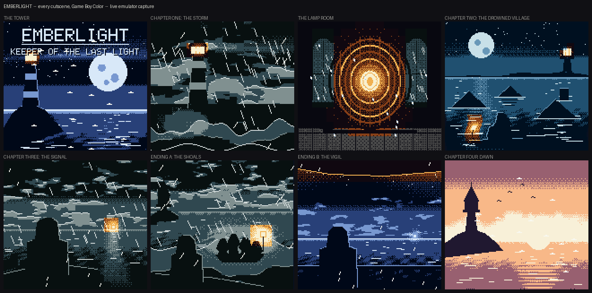
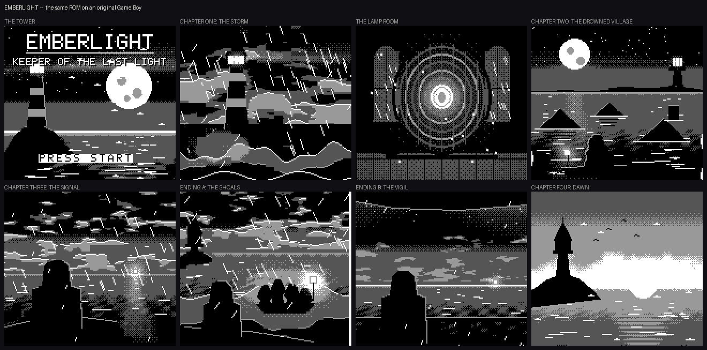

# EMBERLIGHT

*Keeper of the Last Light* — a story-driven Game Boy game in RGBDS assembly.

The sea has been rising for a hundred years. One lighthouse is left on this
coast, and Mira Cale is seventeen years old and its keeper. Tonight the ember
that has burned since the first keeper is down to the size of her thumbnail,
and out past the shoals something is signalling: three short, one long. The
same signal her father rowed out to, and did not come back from.

A cinematic point-and-click in four chapters, with two endings. Runs on an
original DMG and in colour on a Game Boy Color, from the same ROM.





---

## Play it

Prebuilt ROMs are checked in — no toolchain needed. Download one and open it
in any Game Boy emulator, or put it on a flashcart.

| file | |
|---|---|
| [`release/emberlight.gb`](release/emberlight.gb) | **start here** — colour on a Game Boy Color, four shades on an original Game Boy |
| [`release/emberlight-dmg.gb`](release/emberlight-dmg.gb) | the same binary with the colour flag cleared, so emulators run it in monochrome even on a GBC |

`release/checksums.md5` covers both. Rebuild them from source with
`make release`.

---

## Building

Needs [RGBDS](https://rgbds.gbdev.io/) 0.9+ and Python 3 with `numpy` and
`pillow`.

```sh
make            # generate assets, assemble, link -> build/emberlight.gb
make preview    # render the artwork to shots/preview.png without emulating
make shots      # play the ROM headlessly in PyBoy and photograph it
make clean

python3 tools/gallery.py          # one portrait of every scene, DMG and GBC
python3 tools/moments.py          # the interactive states
python3 tools/capture.py --dmg    # a full playthrough in monochrome
```

`make` produces two ROMs from one object file:

| file | notes |
|---|---|
| `build/emberlight.gb` | the game — colour on GBC, greyscale on DMG |
| `build/emberlight-dmg.gb` | identical code with the colour flag cleared, for testing the monochrome path |

## Playing

| | |
|---|---|
| **A** | advance dialogue, examine, choose |
| **B** *(held)* | fast-forward text |
| **D-pad** | move the reticle in explore scenes, pick a menu option |
| **A** *(repeatedly)* | breathe on the ember |

---

## How it is put together

Two halves: an engine in Z80 assembly that knows nothing about the story, and
a Python pipeline that generates everything it reads.

```
src/                  the engine (ROM0, ~3300 lines of RGBDS assembly)
  main.asm            vectors, boot, interrupt handlers, frame loop
  hardware.inc        hardware register definitions
  engine/
    defs.inc          VRAM budget, opcodes, the WRAM map
    vm.asm            the cutscene interpreter
    video.asm         picture loading, tile maps, colour palettes
    fade.asm          cross-fades for both hardware targets
    text.asm          dialogue box and typewriter printing
    fx.asm            weather, embers, water shimmer, screen shake
    explore.asm       reticle and hotspots
    input.asm         joypad edge detection
    audio.asm         two-channel sequencer and sound effects

tools/                the asset pipeline (Python)
  gbart.py            a small painting library aimed at 4-shade artwork
  gbfont.py           the typeface, shared by the ROM and the art
  scenes.py           every full-screen picture, painted in code
  tileconv.py         image -> tiles + tile map + attribute map
  story.py            the whole script: prose, pacing, branches
  build_assets.py     runs all of the above, emits RGBASM sources
  preview.py          render the art without building a ROM
  capture.py          play the ROM headlessly and photograph it
  gallery.py          one clean portrait of every cutscene, both machines
  moments.py          photograph the interactive states specifically
```

### The picture problem

The background layer can only address 256 tiles at once. The font, the
dialogue-box chrome and the effect sprites have to stay resident, which leaves
**176 tiles** for the picture — and a full screen is 20×18 = **360 cells**. So
every cutscene needs better than 2:1 deduplication.

Exact deduplication gets most of the way (skies and water repeat heavily).
Whatever is left is handled by `reduce_to_budget`, which repeatedly folds the
cheapest surviving tile into its nearest neighbour — cheapest meaning *fewest
cells affected, times how different the replacement looks*. That makes the fit
guaranteed for any input, and puts the quality loss on rare, low-contrast
tiles first. Typical scenes arrive at 200–270 unique tiles and lose the
difference without it showing.

### Painting for four shades

Scenes are painted in continuous luminance and dithered down in a single pass
at the end, so gradients can be authored normally. Three things do most of the
work:

- **`snap()`** sharpens the fractional part of the luminance before
  quantising, collapsing a gradient into flat bands with a narrow stipple seam
  where shades meet. A plain gradient dithers across its whole span and reads
  as one field of noise; this is the poster look real Game Boy art uses, and
  it is far kinder to the tile budget.
- **Anisotropic noise.** Weather is not isotropic. Round noise reads as
  camouflage; the same noise stretched three-to-one along the horizon reads as
  cloud.
- **Rim lights.** A black tower against a black sky is invisible. Silhouettes
  get a one-pixel lit edge — for figures, by stamping the same contour one
  pixel toward the light before filling it.

### The script is data

`tools/story.py` holds the entire game as a Python program that emits
bytecode. Prose is written as ordinary sentences and word-wrapped to the
dialogue box by the build; pacing reads top to bottom like a shooting script:

```python
s.pic(None, 'storm')
s.music(MUS_STORM)
s.fx(FX_RAIN_HEAVY)
s.fadein(5)
s.beat(50)
s.sfx(SFX_THUNDER)
s.flash(2)
s.shake(24)
s.text("""
The sea has been
climbing for a hundred years.
...
""")
```

The engine's `RunScript` walks the resulting byte stream through a jump table.
Twenty-five opcodes cover pictures, fades, dialogue, choices, weather, shake,
chapter cards, the explore segments, the ember mini-game and branching.

### Colour without a second art pipeline

The same 2bpp tiles serve both machines. On DMG the four shades go through
`BGP` directly; on Game Boy Color each scene ships up to 8 palettes plus a
per-cell attribute map, generated from a region mask the painter returns
alongside the image. Two palettes are reserved: 7 for the dialogue box, 6 for
chapter cards, which print light-on-dark and therefore need an inverted `BGP`
ramp on DMG.

Fading is the same idea twice. On DMG there is one background palette
register, so a fade walks `BGP` down a five-step ramp. On CGB the real colours
are scaled component-wise through a lookup table, giving a proper dip to black
instead of a four-step lurch. Palettes are double-buffered and pushed in
VBlank so a fade never tears.

### Timing

Everything that draws does it in the few hundred cycles left after the VBlank
handler returns — a row of tile map, a glyph, a queued tile. Nothing blanks the
LCD except picture loads, which only happen behind a fade.

`FxStep` runs once a frame from every wait loop in the engine, so weather and
music keep going under dialogue, fades and menus. It clobbers every register,
which is why loop counters throughout the engine live in WRAM rather than in
`b` or `c`.

### Screenshots are real

`tools/capture.py` runs the ROM in PyBoy and plays it: it reads a handful of
engine variables out of WRAM via the linker's symbol file, so it knows when
control has passed to the reticle or the ember gauge, and plays those properly
instead of mashing A into a wall. Every image in this repository is emulator
output.

---

## Footprint

| | |
|---|---|
| ROM | 64 KB, MBC5, 4 banks used of 4 |
| bank 0 | engine, font, sprites — 6.1 KB of 16 KB |
| bank 1 | story bytecode and prose — 4.4 KB |
| banks 2–3 | eight full-screen pictures — 87% and 90% full |
| WRAM | 834 bytes of 4 KB |
| pictures | 8 × 176 tiles, ~4 KB each |
| script | 110 opcodes, 33 strings, 4.2 KB of prose |

There is room for roughly four more cutscenes per added bank, and MBC5 goes to
512 banks.

## Known limitations

- No save. The game is about half an hour and runs start to finish; there was
  no battery in the cartridge header to write to.
- Music is two pulse channels. The wave and noise channels are only used for
  sound effects.
- The per-scanline water shimmer (`FX_WATER`) drives `SCX` from the STAT
  interrupt. It behaves on PyBoy and should on hardware, but it is the one
  effect whose timing is tight enough to be worth checking on a real console.
