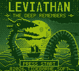

# LEVIATHAN — title screen

*The deep remembers.*

A 160×144 Game Boy title screen in the original DMG's four greens and nothing
else. No ROM here — this is the art and the generator that paints it.


Native size, which is how it would actually look on the handheld:



## Building

Needs Python 3 with `numpy` and `pillow`.

```sh
make            # -> out/
```

It prints what it made:

```
shades      : darkest 53.0%, dark 23.3%, light 8.9%, lightest 14.8%
unique tiles: 353 of 360 (VRAM holds 384)
tile data   : 5648 bytes
display     : split at tile row 5 (y=40) -- 98 tiles above only, 254 below only, 1 shared
```

| file | |
|---|---|
| `out/title.png` | 160×144, indexed, exactly four colours |
| `out/title@4x.png` | the same image nearest-neighboured to 4x |
| `out/title.2bpp` | deduplicated tile data, DMG 2bpp |
| `out/title.tilemap` | 20×18 map indexing into it |

Everything is deterministic — the RNG seed is fixed and no wall-clock value is
read, so a rebuild is byte-identical.

## The palette

```
#0F380F   darkest    #306230   dark    #8BAC0F   light    #9BBC0F   lightest
```

Worth knowing before you draw anything: **the two pale greens are barely a
shade apart.** `#8BAC0F` and `#9BBC0F` differ by 16 in each channel. Anything
rendered light-on-lightest is invisible in practice, so all of the real
contrast in the picture lives between the dark pair and the light pair. Three
things in this screen were redrawn once that sank in:

* The moon's maria started as flat light-green and disappeared against the
  disc. They are now painted at mid-luminance and left to dither, so they land
  as a stipple of light *and* dark — which is what actually reads as grey.
* The logo started with a lightest/light two-tone face. Also invisible. The
  relief is now cut in the dark half of the ramp: one pixel of dark inside the
  bottom and right edge of every stroke.
* The serpent's hide is banded in dark-on-black. It is the quietest contrast
  pair available, which is exactly what a silhouette wants — enough to stop
  a hundred-pixel black shape reading as a hole punched in the picture, not
  so much that the outline breaks up.

## How it is painted

`tools/gbcanvas.py` is a small painting library. You paint in continuous
luminance (0.0 black … 1.0 white) with ordinary 2D primitives, and one ordered
Bayer dither at the end lands everything on the four shades.

The part that matters is that every pixel carries a second value, a **dither
strength**. At 1.0 the Bayer matrix breaks the luminance into stipple; at 0.0
it snaps to the nearest shade and stays there. Skies, water and the moon's limb
are painted at full strength; silhouettes, lettering, rim lights and foam are
painted at zero. That is the whole trick behind the picture being both soft and
sharp — gradients stipple, edges do not.

Shapes are rasterised 4× oversampled and thresholded at 50% coverage, so curves
and diagonals come out clean without ever introducing a fifth grey.

The serpent is swept along Catmull-Rom splines: `segment()` takes control
points and a radius profile, builds the outline by offsetting the path normals,
and can crest the result with dorsal fins and rule it into segments in one
call.

`tools/gbfont.py` holds two typefaces. The 5×7 face used for the tagline and
the prompts is stored as literal pixel art, so what you read in the source is
what lands on screen. The display face for LEVIATHAN is nine 12×20 glyphs
described as polygons on a floating-point grid, which is why the diagonals in
the V, A and N are not staircases.

## Composition

Drawing order carries most of the weight:

* The moon sits left of centre and **the head is painted straight over it**, so
  the most detailed silhouette in the picture is backlit and needs no outline
  at all. The open jaw works because the gap shows white moon through it.
* Everything on the right half stands against dark sky instead, so it gets a
  hard moonlit rim. The rim is applied *only where the backdrop behind that
  edge is dark* — the generator samples the background before the creature is
  painted — which is why the head has no rim where it crosses the disc and the
  coil has one all the way round.
* The sea ramps from near-white at the horizon to near-black at the bottom of
  the frame, and sideways it follows the moon's glitter path and falls away to
  both edges. That gives the ship a bright field to be a silhouette against,
  and leaves the foreground dark enough to hold lettering.
* The moonglow is deliberately weak. A corona bright enough to look pretty
  swallows the limb of the disc, and the moon stops being a moon.

## Getting it on hardware

A background map entry is 8 bits, so only 256 tiles are addressable at once:
LCDC bit 4 chooses between `$8000` (tiles 0–255, unsigned) and `$8800`
(tiles 128–383, signed). This screen needs 353 distinct tiles, so it does not
fit a single base.

It does fit two. `split_plan()` searches for a tile row where rewriting LCDC
bit 4 from an LCD STAT interrupt gives the top and bottom of the screen
different windows onto the same 384 tiles, and reports the best one — here,
switching at tile row 5 (y = 40) leaves 98 tiles used only above, 254 used only
below, and 1 shared, all of which place. Same trick the road in `gbhorizon`
uses on `SCX`, one register over.

If you would rather not touch STAT, the generator tells you the tile count; the
way to get under 256 is to spend fewer of them on dithered sky.
